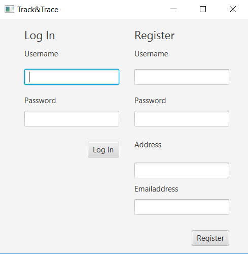
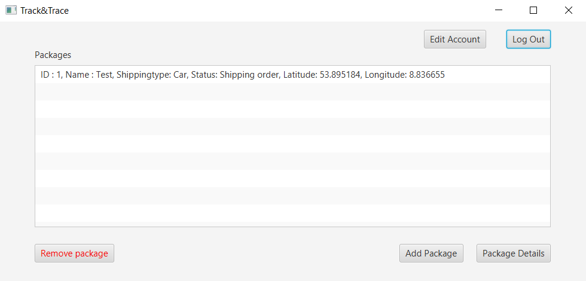
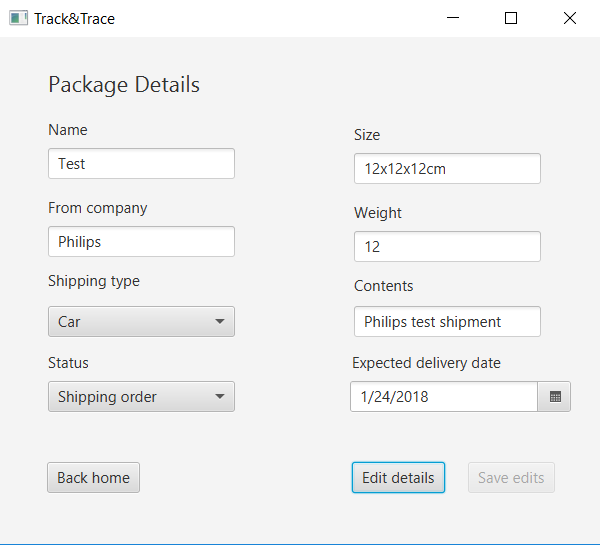

# TrackAndTrace Client application
## Functionality
This application serves as a client for the [TrackAndTraceServer application](https://github.com/Martijnvos/TrackAndTraceServer).  
It has a user interface made in javafx with which you can interact to do the following things:
- Log in using a registered account with corresponding password
- Register for a new account
- Get an overview of the packages connected to your account
- Add package to account (admin)
- Edit package details (admin)
- Remove packages from account (admin)
- Edit account information
- Log out of the current account

## Screenshots
Login                                         |  Homepage                                     | Package Details
:--------------------------------------------:|:---------------------------------------------:|:-----------------------------------------------------------:
 |     | 

## Running the application
The application can be run by simply downloading the source code and running it in your favorite editor.
Keep in mind that this application depends on the [TrackAndTraceServer application](https://github.com/Martijnvos/TrackAndTraceServer).

:warning: Warning: make sure this and the server application is not run with a VPN or other IP changing service.
If this is the case it's not guaranteed that this application can find the registry.